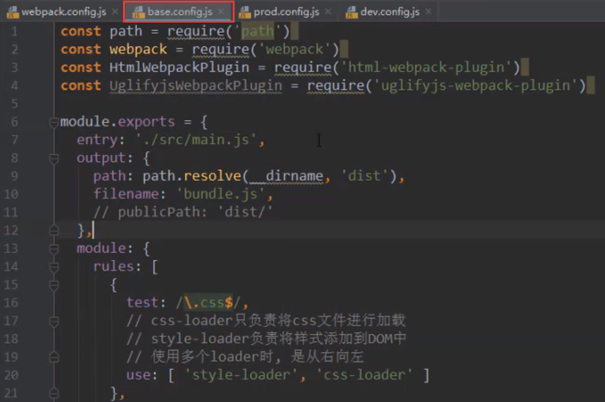
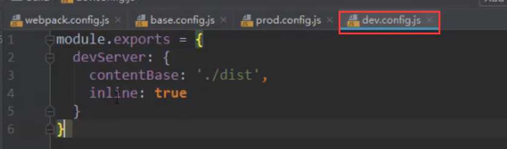
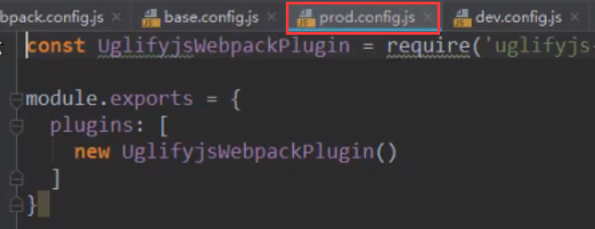

# 搭建本地的服务器
```text
    npm install webpack-dev-server@2.9.3 --save-dev
    // 版本号与webpack相关 
```
## 配置
```javascript
model.export={
    devServer:{
        contentBase:'./dist',       // 为哪一个文件夹提供服务
        inline : true,              // 页面实时刷新
        port:8080,                  // 监听的端口号
        historyApiFullback:true     // SPA中以来H5的history模式
    }
}
// package.json中
{
    "scripts" : {
        "dev":"webpack-dev-server --open"  // --open 会自动打开一个页面
    }
}
```

# 对webpack配置文件进行分离
## 分离 基础文件/开发文件/发布文件
### base.config.js 基础文件


### dev.config.js 开发时的配置文件


### prod.config.js 发布时的配置文件


### 合并
```text
npm install webpack-merge --save-dev
```
```javascript
// 以dev.config.js为例
const webpackMerge = require('webpack-merge');
const baseConfig = require('base文件的路径');
module.export = webpackMerge(baseConfig,{
    devServer:{
        contentBase:'./dist',
        inline:true
    }
})
```
### 最终使用
在package.json中使用
```javascript
// package.json中
{
    "scripts" : {
        "build":"webpack --config (发布时的配置文件 prod.config.js文件的路径)"
        "dev":"webpack-dev-server --open --config (开发时的配置文件 prod.config.js文件的路径)"  // --open 会自动打开一个页面
    }
}
```
